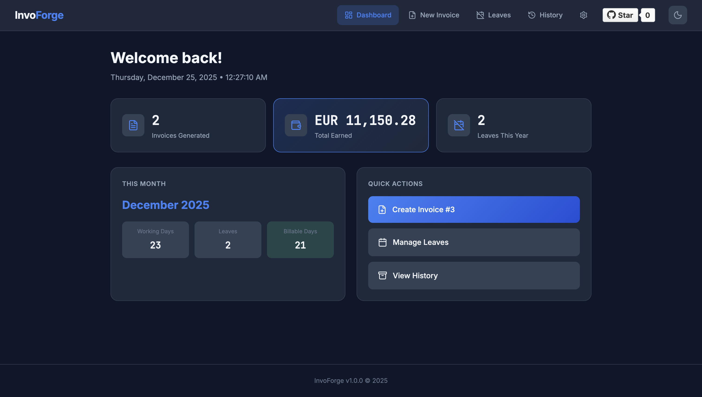
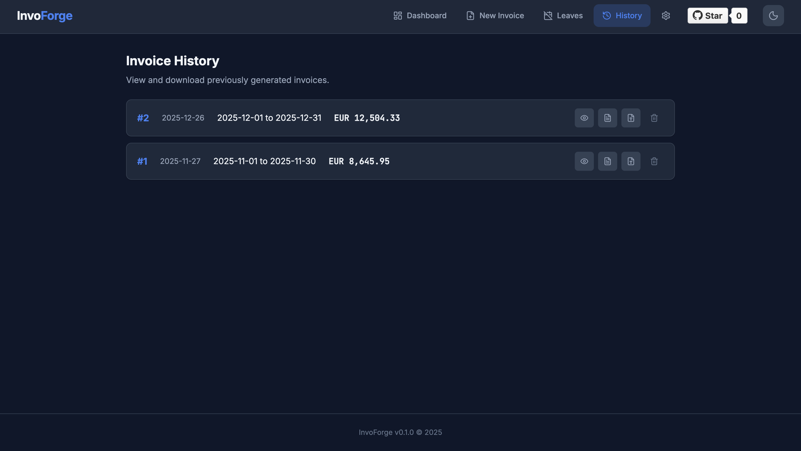
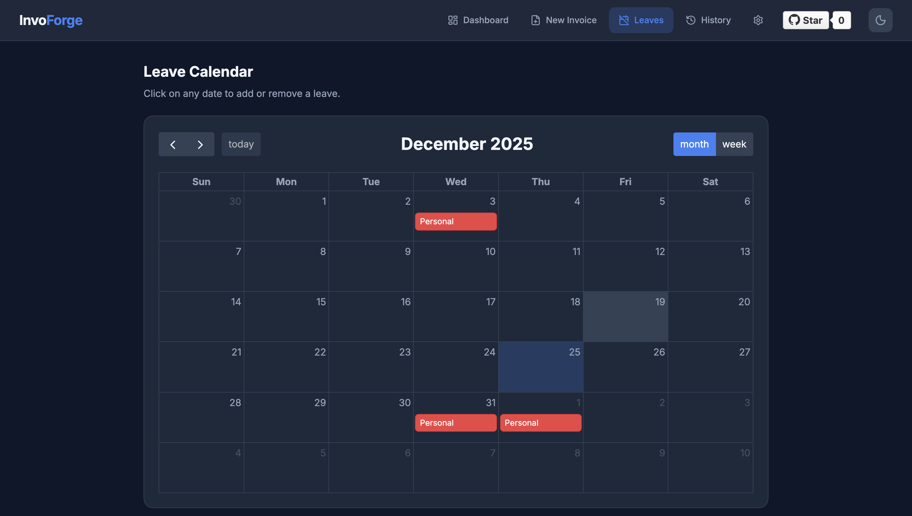

<p align="center">
  
</p>

<h1 align="center">InvoForge</h1>

<p align="center">
  <strong>Professional invoice generator crafted for freelancers</strong><br>
  Built with Clean Architecture and SOLID principles
</p>

<p align="center">
  <a href="https://github.com/1231varun/invoforge/stargazers">
    
  </a>
  <a href="https://github.com/1231varun/invoforge/network/members">
    
  </a>
  <a href="https://github.com/1231varun/invoforge/watchers">
    
  </a>
</p>

<p align="center">
  <a href="https://github.com/1231varun/invoforge/releases">
    
  </a>
  <a href="https://github.com/1231varun/invoforge/actions/workflows/ci.yml">
    
  </a>
  <a href="https://codecov.io/gh/1231varun/invoforge">
    
  </a>
  <a href="https://github.com/1231varun/invoforge/blob/main/LICENSE">
    
  </a>
  
</p>

<p align="center">
  <a href="#features">Features</a> •
  <a href="#quick-start">Quick Start</a> •
  <a href="#usage">Usage</a> •
  <a href="#roadmap">Roadmap</a> •
  <a href="#contributing">Contributing</a>
</p>

---

<!-- 
## 📸 Screenshots

<p align="center">
  
</p>

<p align="center">
  
  
</p>

To add screenshots:
1. Create folder: .github/screenshots/
2. Add PNG images: dashboard.png, invoice.png, calendar.png
3. Uncomment this section
-->

## ✨ Features

- 📊 **Dashboard** - Stats overview at a glance
- 📅 **Auto-calculated Working Days** - Weekdays minus leaves
- 🔢 **Auto-increment Invoice Numbers** - No manual tracking
- 🗓️ **Leave Calendar** - Visual calendar to track leaves (FullCalendar)
- 📁 **Invoice History** - Download previous invoices
- ⚙️ **Settings Panel** - Update business details anytime
- 🧙 **First-time Setup Wizard** - Guided configuration
- 📄 **PDF & DOCX Export** - Choose your format
- 📱 **PWA Support** - Works offline, installable on any device
- 💻 **Cross-Platform** - Windows, macOS, Linux
- 🌙 **Theme Support** - Light and dark modes

## 🚀 Quick Start

### Option 1: Download Release (Easiest)

1. Go to [**Releases**](https://github.com/1231varun/invoforge/releases)
2. Download the ZIP for your OS (Windows/macOS/Linux)
3. Extract and run `InvoForge`
4. Opens in your browser automatically

### Option 2: Run from Source

```bash
# Clone
git clone https://github.com/1231varun/invoforge.git
cd invoforge

# Setup (one-time)
python3 -m venv venv
source venv/bin/activate      # Windows: venv\Scripts\activate
pip install -r requirements.txt

# Run
python run.py
```

Open http://127.0.0.1:5665

### Option 3: Docker (Coming Soon)

```bash
docker run -p 5665:5665 1231varun/invoforge
```

## 📋 Requirements

- **Python 3.9+** (for running from source)
- **LibreOffice** (optional, for PDF conversion)
  - macOS: `brew install --cask libreoffice`
  - Ubuntu: `sudo apt install libreoffice`
  - Windows: Download from [libreoffice.org](https://www.libreoffice.org/)

## 🧭 First-Time Setup

On first launch, the setup wizard guides you through:

1. **Business Details** - Your name, address, GSTIN, PAN
2. **Client Details** - Primary client information  
3. **Export & Bank** - LUT number, bank account, signatory name
4. **Billing Defaults** - Daily rate, currency, service description

All settings can be changed later in the Settings tab.

## 📖 Usage

### Generate Invoice
1. Go to **New Invoice** tab
2. Verify/adjust the auto-filled details
3. Select output format (PDF / DOCX / Both)
4. Click **Generate Invoice**
5. Download from the page or **History** tab

### Track Leaves
1. Go to **Leaves** tab
2. Click on calendar dates to add/remove leaves
3. Leaves auto-subtract from working days

### View History
1. Go to **History** tab
2. See all generated invoices
3. Download DOCX or PDF anytime

### Theme Toggle
Click the sun/moon icon in the header to switch between light and dark modes.

## 🗺️ Roadmap

InvoForge is actively developed. Here's what's coming:

### Free (Community Edition)
- [x] Basic invoice generation
- [x] Leave tracking
- [x] PDF/DOCX export
- [x] Dark mode
- [ ] Docker support
- [ ] Multiple invoice templates
- [ ] Multi-language support

### Pro (Coming Soon)
- [ ] Multiple client profiles
- [ ] Recurring invoices
- [ ] Email invoices directly
- [ ] Cloud sync & backup
- [ ] Custom branding
- [ ] Advanced analytics
- [ ] Priority support

> 💡 **Interested in Pro?** [Star this repo](https://github.com/1231varun/invoforge) to stay updated!

## 🏗️ Architecture

```
app/
├── core/                    # Domain Layer
│   ├── entities/            # Invoice, Leave, Settings
│   ├── interfaces/          # Repository ports
│   └── services/            # Calculation logic
├── application/             # Use Cases
│   └── use_cases/           # Business operations
├── infrastructure/          # External Implementations
│   ├── persistence/         # SQLite repositories
│   └── documents/           # DOCX/PDF generators
├── presentation/            # Flask Web Layer
│   └── routes/              # API endpoints
├── container.py             # Dependency injection
└── __init__.py              # Flask app factory
```

## 🛠️ Development

```bash
# Clone and setup
git clone https://github.com/1231varun/invoforge.git
cd invoforge
python3 -m venv venv
source venv/bin/activate  # Windows: venv\Scripts\activate

# Install dev dependencies (includes testing & linting)
pip install -r requirements-dev.txt

# Install pre-commit hooks
pre-commit install

# Run in debug mode
python run.py
```

### Quick Commands (Makefile)

```bash
make install-dev  # Install dev dependencies + pre-commit hooks
make test         # Run all tests
make test-cov     # Run tests with coverage report
make lint         # Run linter
make format       # Format code
make check        # Run all checks (lint + format + tests)
make run          # Run dev server
```

### Testing

```bash
# Run all tests
pytest

# Run unit tests only (fast)
pytest tests/unit -v

# Run with coverage
pytest --cov=app --cov-report=term-missing
```

### Linting

```bash
# Check for issues
ruff check .

# Auto-fix issues
ruff check --fix .

# Format code
ruff format .
```

### Versioning

InvoForge uses [Semantic Versioning](https://semver.org/) with two version numbers:

| Version | Location | Purpose |
|---------|----------|---------|
| `APP_VERSION` | `app/version.py`, `static/sw.js` | App release version (0.1.0, 0.2.0, 1.0.0) |
| `CACHE_VERSION` | `static/sw.js` | PWA cache version - bump when static files change |

**Version files to update on release:**
- `app/version.py` - Main version
- `static/sw.js` - Service worker versions
- `CHANGELOG.md` - Release notes

### Building Releases

Releases are built automatically via GitHub Actions when you push a version tag:

```bash
# Update version in files first, then:
git add .
git commit -m "Bump version to 0.2.0"
git tag v0.2.0
git push origin main --tags
```

This creates executables for Windows, macOS, and Linux.

## 🔧 Tech Stack

| Layer | Technology |
|-------|------------|
| Backend | Flask, Python 3.9+ |
| Frontend | Vanilla JS, CSS Custom Properties |
| Icons | Lucide Icons (MIT) |
| Calendar | FullCalendar |
| Database | SQLite |
| Documents | python-docx, LibreOffice |

## 📄 License

**Non-Commercial License** - © 2025 Varun K Nair. All Rights Reserved.

- ✅ Free for personal use
- ✅ Can modify for personal use
- ❌ Commercial use requires permission
- ❌ Cannot sell or redistribute commercially

See [LICENSE](LICENSE) for full terms. For commercial licensing, contact the owner.

## 🤝 Contributing

Contributions are welcome! Here's how:

1. ⭐ Star the repo (it helps!)
2. 🍴 Fork the repository
3. 🔧 Create a feature branch (`git checkout -b feature/amazing-feature`)
4. 💾 Commit your changes (`git commit -m 'Add amazing feature'`)
5. 📤 Push to the branch (`git push origin feature/amazing-feature`)
6. 🔃 Open a Pull Request

## 💬 Support

- 🐛 [Report a Bug](https://github.com/1231varun/invoforge/issues/new?template=bug_report.md)
- 💡 [Request a Feature](https://github.com/1231varun/invoforge/issues/new?template=feature_request.md)
- 💬 [Discussions](https://github.com/1231varun/invoforge/discussions)

---

<p align="center">
  <strong>InvoForge</strong> - Forged for Freelancers ⚒️
</p>

<p align="center">
  <a href="https://github.com/1231varun/invoforge">
    
  </a>
</p>
